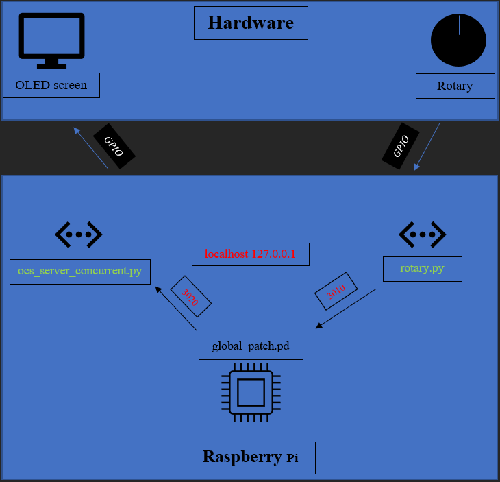

# autonomusberry
## A folder containing several codes allowing you to interact with puredata from GPIO using python and OSC on Raspberry

The project is to use a Raspberry generating Farnell pd patches as an input for a modular we built and an arduino digital sequencer. The Modularduino repository by @SuhtrA contains all the code for the arduino sequencer. Check it out ! 
Special thanks to @maudinator for the composition and to @merov13 for conceiving and creating de analog modular.

------------------------

### Requirements
1. Raspbian on a Raspberry Pi 
   -mine is a 2 model B V1.1
2. puredata (0.51.4-1)
3. python3 (python2 might work)
   -Librairies :
      -pythonosc
      -Adafruit
      -gpiozero
4. A rotary encoder
5. An oled screen

### GPIO input and OSC client
The rotary.py is a script controlling GPIO input (buttons, etc...) and sends OSC messages. Change IP, port, name of the message and GPIO button address according to what you need.

### OSC server and OLED display
The osc_server_concurrent.py allows you to receive OSC messages and display them on an oled screen pluged into the GPIO. Change name of the message in the filter_handler and whatever you need to display.

--------------------
### Working Principle

--------------------

All the code in the script is inspired by the examples scripts from pythonosc and gpiozero libraries. Thanks to them !

A global_patch allow you to communicate with python scripts. Thanks to Andy Farnell for the content.

Enjoy and contact me if you need extra info ;)

